# Connector Builder MCP Secrets Handling

This diagram shows how the Connector Builder MCP handles secrets securely, ensuring that LLMs never see actual secret values while still enabling them to manage connector configurations that require secrets.

```mermaid
graph TB
    %% User Secret Sources
    subgraph "Secret Sources"
        A[".env Files<br/>(Local dotenv files)"]
        B["Privatebin URLs<br/>(Remote encrypted storage)"]
        C["PRIVATEBIN_PASSWORD<br/>(Environment variable)"]
    end

    %% LLM Tools Layer
    subgraph "LLM-Accessible Tools"
        D["list_dotenv_secrets()<br/>Returns: SecretInfo[]<br/>{key: string, is_set: boolean}"]
        E["populate_dotenv_missing_secrets_stubs()<br/>Creates placeholder entries<br/>for missing secrets"]
        F["Connector Manifest Creation<br/>LLM writes YAML expecting<br/>secret inputs"]
    end

    %% Internal Processing Layer
    subgraph "Internal Processing (Hidden from LLM)"
        G["_load_secrets()<br/>Loads actual secret values<br/>from sources"]
        H["hydrate_config()<br/>Merges secrets into<br/>connector configuration"]
        I["_filter_config_secrets_recursive()<br/>Masks sensitive values<br/>in logs/output"]
    end

    %% Runtime Execution
    subgraph "Runtime Execution"
        J["Connector Testing<br/>Uses hydrated config<br/>with real secrets"]
        K["Validation & Testing<br/>Real API calls with<br/>authenticated requests"]
    end

    %% User Interaction Flow
    A --> D
    B --> D
    C --> G
    A --> G
    B --> G

    %% LLM Tool Usage
    D --> |"LLM sees: api_key=true<br/>password=false"| E
    E --> |"Creates stubs for<br/>missing secrets"| A
    F --> |"Defines expected<br/>secret fields"| E

    %% Internal Processing Flow
    G --> H
    H --> J
    H --> K
    J --> I
    K --> I

    %% Security Boundaries
    classDef userLayer fill:#e1f5fe
    classDef llmLayer fill:#f3e5f5
    classDef internalLayer fill:#fff3e0
    classDef runtimeLayer fill:#e8f5e8

    class A,B,C userLayer
    class D,E,F llmLayer
    class G,H,I internalLayer
    class J,K runtimeLayer

    %% Security Notes
    subgraph "Security Principles"
        L["🔒 LLM Never Sees Secret Values<br/>Only metadata about availability"]
        M["🔄 Runtime Hydration Only<br/>Secrets injected during execution"]
        N["🚫 No Secret Persistence<br/>Values not stored in LLM context"]
    end

    style L fill:#ffebee
    style M fill:#ffebee
    style N fill:#ffebee
```

## Key Security Features

1. **Secret Isolation**: The LLM can only see whether secrets are set or not (`is_set: boolean`) but never the actual values
2. **Runtime Hydration**: Secrets are only injected into configurations during actual connector execution
3. **Multiple Sources**: Supports both local `.env` files and remote Privatebin URLs for secret storage
4. **Missing Secret Detection**: LLM can identify which secrets are required but not yet provided
5. **Manifest-Driven**: LLM can create connector definitions that specify expected secret fields without knowing the values

## Tool Functions

- `list_dotenv_secrets()`: Returns metadata about available secrets without exposing values
- `populate_dotenv_missing_secrets_stubs()`: Creates placeholder entries for secrets the LLM identifies as needed
- `hydrate_config()`: Internal function that merges actual secret values into connector configurations at runtime
- `_filter_config_secrets_recursive()`: Ensures sensitive values are masked in any output that might be visible to the LLM
