# Connector Builder MCP Secrets Handling

This sequence diagram shows how the Connector Builder MCP handles secrets securely, ensuring that LLMs never see actual secret values while still enabling them to manage connector configurations that require secrets.

```mermaid
sequenceDiagram
    participant User
    participant LLM
    participant MCP as MCP Server
    participant SM as Secret Manager<br/>(dotenv/privatebin)

    Note over User, SM: 🔒 Secret Setup Phase
    User->>SM: Store secrets in .env file or privatebin URL
    User->>User: Set PRIVATEBIN_PASSWORD env var (if using privatebin)
    
    Note over User, SM: 📋 Secret Discovery Phase
    LLM->>MCP: list_dotenv_secrets(dotenv_path)
    MCP->>SM: Load secret metadata only
    SM-->>MCP: Return keys and is_set status
    MCP-->>LLM: SecretInfo[]{key: "api_key", is_set: true}<br/>{key: "password", is_set: false}
    Note right of LLM: LLM sees availability<br/>but never actual values

    Note over User, SM: 🔧 Missing Secret Detection
    LLM->>MCP: populate_dotenv_missing_secrets_stubs(manifest)
    MCP->>MCP: Extract required secrets from manifest
    MCP->>SM: Check existing secrets
    SM-->>MCP: Return current secret status
    MCP->>SM: Create placeholder stubs for missing secrets
    MCP-->>LLM: "Added stubs for: oauth.client_secret"
    LLM->>User: "Please set values for missing secrets"

    Note over User, SM: ✍️ Connector Definition Creation
    LLM->>LLM: Write connector manifest YAML<br/>expecting secret inputs
    LLM->>MCP: validate_manifest(manifest_yaml)
    Note right of LLM: LLM defines expected<br/>secret fields without<br/>knowing values

    Note over User, SM: 🚀 Runtime Execution Phase
    LLM->>MCP: execute_stream_test_read(manifest, dotenv_path)
    MCP->>SM: _load_secrets() - Load actual values
    SM-->>MCP: Return real secret values
    MCP->>MCP: hydrate_config() - Merge secrets into config
    Note right of MCP: Secrets injected at runtime<br/>Never shared back to LLM
    MCP->>MCP: Execute connector with hydrated config
    MCP->>MCP: _filter_config_secrets() - Mask output
    MCP-->>LLM: Test results with secrets redacted
    Note right of LLM: LLM sees test results<br/>but secrets are masked

    Note over User, SM: 🔒 Security Principles
    Note right of SM: • LLM never sees actual secret values<br/>• Secrets only hydrated at runtime<br/>• All outputs are filtered/masked<br/>• Multiple secret sources supported
```

## Key Security Features

1. **Secret Isolation**: The LLM can only see whether secrets are set or not (`is_set: boolean`) but never the actual values
2. **Runtime Hydration**: Secrets are only injected into configurations during actual connector execution
3. **Multiple Sources**: Supports both local `.env` files and remote Privatebin URLs for secret storage
4. **Missing Secret Detection**: LLM can identify which secrets are required but not yet provided
5. **Manifest-Driven**: LLM can create connector definitions that specify expected secret fields without knowing the values

## Sequence Flow Explanation

### Phase 1: Secret Setup
- User stores secrets in dotenv files or privatebin URLs
- Environment variables like `PRIVATEBIN_PASSWORD` are configured

### Phase 2: Secret Discovery
- LLM calls `list_dotenv_secrets()` to discover available secrets
- MCP Server returns only metadata (key names and availability status)
- LLM never receives actual secret values

### Phase 3: Missing Secret Detection
- LLM calls `populate_dotenv_missing_secrets_stubs()` with connector manifest
- MCP Server analyzes manifest to identify required secrets
- Placeholder stubs are created for missing secrets
- LLM can inform user about what secrets need to be set

### Phase 4: Connector Definition Creation
- LLM writes connector manifest YAML expecting certain secret inputs
- Manifest validation occurs without exposing secret values

### Phase 5: Runtime Execution
- During connector testing, MCP Server loads actual secret values via `_load_secrets()`
- Secrets are hydrated into configuration via `hydrate_config()`
- Connector executes with real secrets for API authentication
- All outputs are filtered via `_filter_config_secrets_recursive()` before returning to LLM

## Tool Functions

- `list_dotenv_secrets()`: Returns metadata about available secrets without exposing values
- `populate_dotenv_missing_secrets_stubs()`: Creates placeholder entries for secrets the LLM identifies as needed
- `hydrate_config()`: Internal function that merges actual secret values into connector configurations at runtime
- `_filter_config_secrets_recursive()`: Ensures sensitive values are masked in any output that might be visible to the LLM
